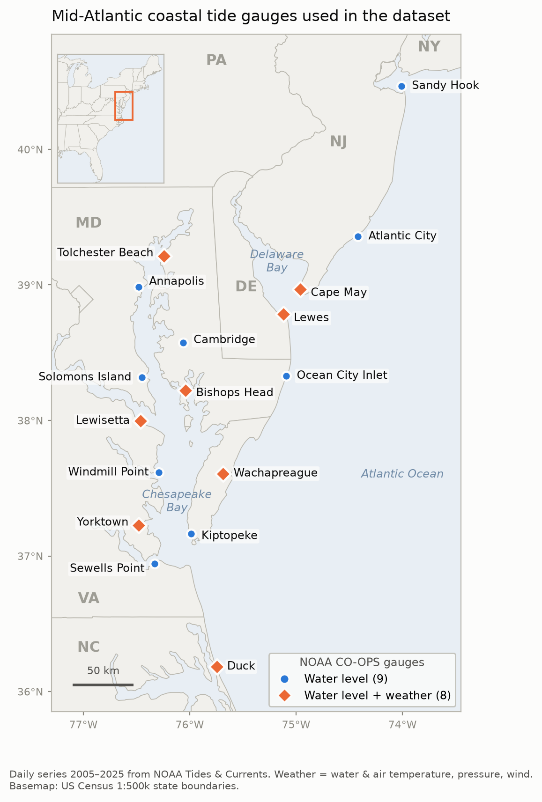

# Analysis of 20 years of Mid-Atlantic tidal data, 2005–2025

All data come from the NOAA CO-OPS Tides & Currents Data API
(`api.tidesandcurrents.noaa.gov/api/prod/datagetter`). 

## Stations (New Jersey → Outer Banks)

I pulled NOAA tidal data from 17 gauges on the open coast, at a bay mouth, on the open Chesapeake, or (Yorktown) just inside the mouth of the York River.

We did not include NOAA stations in harbors or up rivers since they are not as relevant to our research question (The Battery NY, Philadelphia PA, Reedy Point DE, Baltimore MD, Washington DC). Their water levels are influenced by river flow, so they will behave differently from coastal marsh sites. Montauk NY was also dropped, to keep the region from New Jersey southward. Bishops Head is the
closest gauge to Blackwater NWR, about 24 km south in the Dorchester County
marshes; Cambridge is about 17 km north, on the Choptank River. 

Water level was pulled at every station. Weather was also pulled at the 8 marked in the map. 

Looking at different tide metrics such as MHW, MSL, MLW are relevant to my own research, which uses Z* elevation relative to tidal range to estimate tree innundation in Mid-Atlantic coastal forests.  

## Columns

| Prefix | Meaning | Units |
|---|---|---|
| `mhhw_<station>` | Day's highest high tide | m above MSL |
| `mhw_<station>` | Average of the day's high tides | m above MSL |
| `msl_<station>` | Average of the day's 24 hourly water levels | m above MSL |
| `mlw_<station>` | Average of the day's low tides | m above MSL |
| `mllw_<station>` | Day's lowest low tide | m above MSL |
| `surge_<station>` | Daily mean of observed minus predicted tide (non-tidal residual, this is a NOAA product) | m |
| `wtemp_<station>` | Water temperature | °C |
| `atemp_<station>` | Air temperature | °C |
| `pres_<station>` | Barometric pressure | mb |
| `wspd_<station>` | Wind speed | m/s |
| `wind_u_`, `wind_v_` | East and north components of the wind vector (direction it blows *toward*) | m/s |

The five tide columns are daily versions of NOAA's tidal datums. NOAA's
official MHHW, MHW, MSL, MLW and MLLW are single fixed numbers per station,
averaged over 1983–2001. These columns apply the same definitions to one day
at a time, so they form a time series. MHHW, MHW, MLW and MLLW come from NOAA's
verified record of every observed high and low tide (`high_low`), which gives
the exact peak heights rather than the nearest hourly reading. MSL comes from
the hourly readings (`hourly_height`).

Days are calendar days. Tides run on a ~24.8 h cycle, so each day's tides
arrive about 50 minutes later and one regularly slips past midnight. About 14%
of days (up to 19% at some stations) have only one high or only one low. On
those days MHW = MHHW or MLW = MLLW.

## Data pulling and assembly

1. `fetch_noaa.py` downloads hourly water level, every observed high and low
   tide, hourly tide predictions, and hourly weather, one year per request, in local standard time (no daylight-saving), metric units, MSL datum. It
   caches the results in `data/raw/` (which we gitignored).
2. `build_dataset.py` averages each day's hourly readings. A day counts only
   if at least 18 of its 24 hours are present. Columns with less than 85% of
   days present are dropped: Wachapreague air temperature and wind, and water
   temperature at Duck and Bishops Head. Gaps of 7 days or less are filled by
   time interpolation (5,538 of ~1.1M cells). Longer outages are left as NaN.
   `data/coverage_daily.txt` lists the remaining NaN count per column.

# Data choices

Our own processing applied some rules:

-  Days with fewer readings ( <18 / 24 hr) are blanked rather than averaged from partial data.

-  Gaps of 7 days or less are filled with a straight line, 5,538 values in total. This is the main thing we add on top of NOAA's data. Setting MAX_GAP = {"D": 0, "W": 0} in build_dataset.py turns it off and leaves every gap blank.

| Column(s) | Missing |
|---|---|
| `msl_wachapreague_va`, `pres_wachapreague_va` | Nov 2005 – May 2008 (~2.5 yr) |
| `atemp/pres/wspd/wind_*_duck_nc` | Nov 2017 – Dec 2019 (~2.2 yr) |
| `atemp/pres/wspd/wind_*_bishops_head_md` | Jan – Nov 2005, May – Dec 2019, Jul – Oct 2021, Mar – May 2022 |
| `msl_bishops_head_md` | Jan – Mar 2005 |
| `wtemp_wachapreague_va` | Apr 2006 – May 2007 |
| `pres_lewes_de` | Jun 2007 – Aug 2008 |
| `wtemp_cape_may_nj` | Nov 2022 – Dec 2023 |
| `wtemp_tolchester_beach_md` | Nov 2023 – Mar 2024, Oct 2024 – Mar 2025 |
| `msl_solomons_md` | Nov 2013 – Apr 2014, Mar – Apr 2015 |
| `atemp_lewes_de` | Aug – Nov 2010 |
| `wspd/wind_*_lewisetta_va` | Mar – Jun 2015 |
| `wtemp_lewisetta_va` | Jul – Sep 2019 |

To get this data yourself: `python fetch_noaa.py && python build_dataset.py`.

| File | Use |
|---|---|
| fetch_noaa | Fetches the raw data using NOAA tidal API |
| build_dataset | Converts data into our final daily format csv |
| make_station_map | Makes a station map of our used tidal guages |
| spatial_analysis.py | This will be seperate of the Time Series final project, doing spatial analyses such as G*, Moran's I to see spatial autocoorelation between sensors |
analysis | 

* note that analysis and spatial analysis are not made yet 